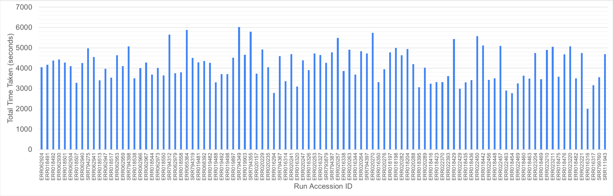
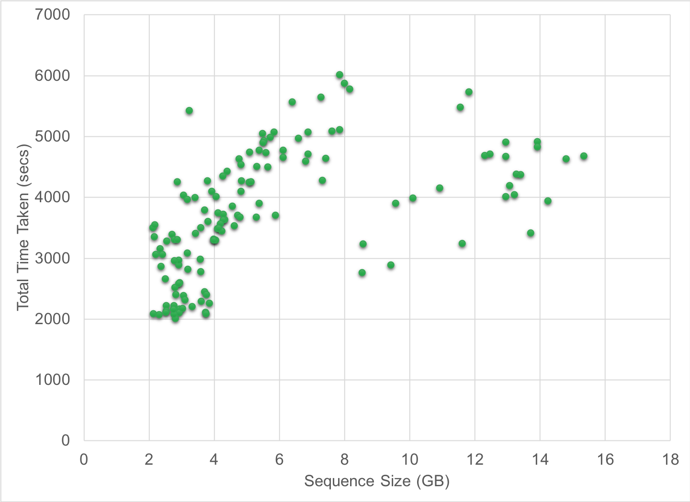

# Exhaustive Variant Analysis (EVA) on Human Genome Sequences

The goal of this
[NSF RAPID project](https://nsf.gov/awardsearch/showAward?AWD_ID=2034247)
is to democratize genome sequence analysis so that researchers can
better understand how COVID-19 affects individuals based on their
genetic makeup. Using [CloudLab](https://cloudlab.us), researchers can
perform variant analysis on genomes ***at no charge***. There is growing
evidence that our genomes may hold the answers to fight COVID-19.
A recent genomic-wide association study linked genes and blood type of
individuals to risk of severe COVID-19
[(NEJM '2020)](https://www.nejm.org/doi/full/10.1056/NEJMoa2020283).
Another study from
[23andMe](https://www.statnews.com/2020/09/14/23andme-study-covid-19-genetic-link/)
hints at links between a person's genes and COVID-19. A recent [Nature publication](https://doi.org/10.1038/s41598-020-77632-8)
identified genes related to five comorbidities that result in severe COVID-19 infection.
[The COVID Human Genetic Effort](https://www.covidhge.com/) is an international
consortium focused on better understanding COVID-19 based on human
genomes.


[[CloudLab account]](#signup-for-a-cloudlab-account)

[[Variant analysis (single node)]](#running-variant-analysis-on-human-genomes-using-a-single-cloudlab-node)
<br/>[[Variant analysis (cluster)]](#running-variant-analysis-on-a-cluster-of-cloudlab-nodes)
<br/>[[De novo assembly (cluster)]](#running-de-novo-assembly-on-a-cluster-of-cloudlab-nodes)

[[Public Datasets]](#public-datasets)

[[Performance evaluation]](#performance-evaluation)

[[Report issues]](#report-issues)

[[Team]](#team)

[[Acknowledgments]](#acknowledgments)

## Signup for a CloudLab account

1. Create an account on CloudLab by signing up [here](https://cloudlab.us/signup.php).  Select "Join Existing Project" with `EVA-public` as the project name.
(If you already have a CloudLab account, then join the project `EVA-public` after logging in to CloudLab.)
<!--[(Screenshot)](images/CloudLab_signup.png?raw=true)("CloudLab Signup")-->
2. By signing up, you agree to follow the [Acceptable Use Policy of CloudLab](https://cloudlab.us/aup.php).
3. After your account is approved, you can login to your account. Read the [CloudLab manual](http://docs.cloudlab.us/) on how to start an experiment.

## Running variant analysis on human genomes using a single CloudLab node

1. Start an experiment using the profile `EVA-single-node-profile` on CloudLab. (Or just click [here](https://www.cloudlab.us/p/8d74b0b9-bfd5-11ea-b1eb-e4434b2381fc).)
You will need to select a node/hardware type such as `xl170` (Utah), `c240g5` (Wisc), etc. The complete list of supported hardware can be found [here](Supported_Machines.txt).  Also provide your CloudLab user name. Check the box to agree to using only deidentified data.
It will take a few minutes to start the experiment; so please be patient.

2. Go to your experiment and in `Topology View` click the node icon and open a shell/terminal to connect to that node.
Alternatively, you can use `SSH` to login to the node: `$ ssh -i /path/to/CloudLab/private_key_file  CloudLab_username@CloudLab_hostname`.
(You can also run [ssh-agent](https://www.ssh.com/ssh/agent) on your local machine to add your private key.)

3. Run the following commands in the shell/terminal:

    **a.** Clone the repo in your home directory.

       $ cd ${HOME}
       $ git clone https://github.com/MU-Data-Science/EVA.git

    **b.** Set up all the tools such as [bwa](https://github.com/lh3/bwa), [samtools](https://github.com/samtools/samtools), [sambamba](https://github.com/biod/sambamba), [Freebayes](https://github.com/ekg/freebayes), [Picard](https://github.com/broadinstitute/picard), [GATK](https://github.com/broadinstitute/gatk), etc. Feel free to modify our scripts if you intend to use other tools for variant analysis.

       $ ${HOME}/EVA/scripts/setup_tools.sh

    **c.** Change directory to local block storage as we need ample space for running variant analysis.

       $ cd /mydata

    **d.** If you already have the reference genome built, copy all the
    files to `/mydata`. Otherwise, set up and index the reference genome
    (e.g., hs38
    ([GRCh38](http://genome.ucsc.edu/cgi-bin/hgTracks?chromInfoPage=&hgsid=857863917_wUC9aW3i9gDVwLAEnS4rRn1MT5Vx)),
    hs37
    ([GRCh37](http://genome.ucsc.edu/cgi-bin/hgTracks?chromInfoPage=&hgsid=857862399_mBXxSwaQbVpPzDMpmtmrA1TeR8WL))).
    This is a one-time step and can take a hour or so depending on the
    node hardware type. To avoid killing the process when the SSH
    session terminates due to disconnection, use the `screen` command.

       $ ${HOME}/EVA/scripts/setup_reference_genome.sh hs38

    **e.** Now copy a whole genome sequence (paired-end) sequence to the
    CloudLab node. It is the user's responsibility to ensure that the
    data are de-identified prior to storing them on the CloudLab node.
    Also see the
    [Acceptable Use Policy of CloudLab](https://cloudlab.us/aup.php).
    Let's use a whole genome sequence sample from
    [The 1000 Genomes Project](https://www.internationalgenome.org/).
    The FTP site is
    `ftp://ftp.1000genomes.ebi.ac.uk/vol1/ftp/phase3/data`.

       $ wget ftp://ftp.1000genomes.ebi.ac.uk/vol1/ftp/phase3/data/HG00096/sequence_read/SRR062635_1.filt.fastq.gz
       $ wget ftp://ftp.1000genomes.ebi.ac.uk/vol1/ftp/phase3/data/HG00096/sequence_read/SRR062635_2.filt.fastq.gz

    If you want to perform variant analysis on a whole exome sequence (paired-end), try the following.

       $ wget ftp://ftp.sra.ebi.ac.uk/vol1/fastq/SRR077/SRR077312/SRR077312_1.fastq.gz
       $ wget ftp://ftp.sra.ebi.ac.uk/vol1/fastq/SRR077/SRR077312/SRR077312_2.fastq.gz 

    If you have deidentified sequences on your local machine to analyze, copy to the CloudLab node using `scp`.

    **f.** There are two variant analysis scripts. Each of them will
    perform the alignment, sorting, marking duplicates, variant
    calling, and [Base Quality Score Recalibration](https://gencore.bio.nyu.edu/variant-calling-pipeline-gatk4/) based on [GATK best practice workflows](https://gatk.broadinstitute.org/). The script `run_variant_analysis_fbayes.sh` uses Freebayes
    for variant calling; `run_variant_analysis_gatk.sh` uses GATK's
    HaplotypeCaller. Run a variant analysis script by passing the
    required arguments. (See usage statement of the script.) Here are
    two examples.

       $ ${HOME}/EVA/scripts/run_variant_analysis_fbayes.sh hs38 SRR062635_1.filt.fastq.gz SRR062635_2.filt.fastq.gz

   OR

       $ ${HOME}/EVA/scripts/run_variant_analysis_gatk.sh hs38 SRR062635_1.filt.fastq.gz SRR062635_2.filt.fastq.gz

    Note that for the GATK pipeline, a dummy [read group](https://gatk.broadinstitute.org/hc/en-us/articles/360035890671-Read-groups) is added to the `.bam` file.

    **g.** The variants are stored in `.output.vcf`
    files. The file ending with `BQSR-output.vcf` contains the variants computed on the analysis-ready reads. Download to your local machine using `scp`.

       $ scp  -i /path/to/CloudLab/private_key_file  CloudLab_username@CloudLab_hostname:/path/to/the/output_VCF_file

    Any `.vcf` file can be further processed using readily available tools such as [scikit-allel](http://alimanfoo.github.io/2017/06/14/read-vcf.html), [VCFtools](https://vcftools.github.io/index.html), and [GATK](https://gatk.broadinstitute.org/hc/en-us/articles/360036711531-VariantsToTable). You can also use visualization tools such as [IGV](https://software.broadinstitute.org/software/igv/download).

    **h.** To perform variant analysis on more genome sequences, go to
    Step **e**.

### Simple steps to run the screen command

    $ screen -s my_session_name

   Press "Ctrl-a" "d" (i.e., control-a followed by d) to detach from the screen session.

   To reattach, do either of the following.

    $ screen -r my_session_name            OR
    $ screen -r

   To check list of screen sessions, type the following.

    $ screen -ls

## Running variant analysis on a cluster of CloudLab nodes
We are using [Apache Spark](https://spark.apache.org),
[Apache Hadoop](https://hadoop.apache.org), [GATK](https://gatk.broadinstitute.org), and 
[Adam/Cannoli](http://bdgenomics.org/).

1. Setup an n-node cluster on CloudLab, following the setup steps
   described [here](cluster_config). (The nodes are named `vm0`, `vm1`,
   etc.) Open a terminal/shell on `vm0`.

2. Setup the reference genome in `/mydata` on `vm0`. See
   [Step 3(c,d)](#running-variant-analysis-on-human-genomes-using-a-single-cloudlab-node)
   above.

3. Download a (paired-end) sequence as shown in
   [Step 3(e)](#running-variant-analysis-on-human-genomes-using-a-single-cloudlab-node)
   above.

4. Copy the (paired-end) sequence to HDFS.
   ```
   $ hdfs dfs -copyFromLocal SRR062635_?.filt.fastq.gz / 
   ```

5. Run variant analysis with [Base Quality Score Recalibration](https://gencore.bio.nyu.edu/variant-calling-pipeline-gatk4/) based on [GATK best practice workflows](https://gatk.broadinstitute.org/). Suppose the cluster size is `16` and `hs38` is the reference genome.
    
    **a.** Using Adam/Cannoli/bwa/Freebayes:
    ```
    $  ${HOME}/EVA/scripts/run_variant_analysis_adam.sh hs38 hdfs://vm0:9000/SRR062635_1.filt.fastq.gz hdfs://vm0:9000/SRR062635_2.filt.fastq.gz 16
    ```
        
    **b.** Using GATK/Spark:
    ```
    $  ${HOME}/EVA/scripts/run_variant_analysis_gatk_spark.sh hs38 hdfs://vm0:9000/SRR062635_1.filt.fastq.gz hdfs://vm0:9000/SRR062635_2.filt.fastq.gz 16
    ```

6. Download the `.vcf` files in the local directories on `vm0`. The file ending with `-BQSR-output.vcf` contains the variants computed on the analysis-ready reads.


## Running de novo assembly on a cluster of CloudLab nodes

We used Apache Spark to parallelize execution of de novo assembly using [ABySS](https://github.com/bcgsc/abyss).
Multiple assemblies will be run on each cluster node using a combination of HDFS and local file systems. Assuming the cluster has been set up to run variant analysis, do the following:

1. Login to `vm0`. The two files [sampleIDs.txt](misc/sampleIDs.txt) and [sampleURLs.txt](misc/sampleURLs.txt) can be used. You can create your own files.
The file `sampleIDs.txt` contains a [run accession ID](https://www.ncbi.nlm.nih.gov/books/NBK56913/) per line. The file `sampleURLs.txt` contains URLs of the FASTQ paired-end sequences.
2. Execute the following command for k-mer length of `31` (default: `51`):
```
${HOME}/EVA/scripts/run_denovo.sh ${HOME}/EVA/misc/sampleIDs.txt ${HOME}/EVA/misc/sampleURLs.txt 31
```
3. Once this task completes, the `.fa` files will be written to HDFS. Check the `.log` file written to `/mydata`.
4. To re-run with a different k-mer length but to avoid downloading the FASTQ files again, try this:
```
${HOME}/EVA/scripts/run_denovo.sh ${HOME}/EVA/misc/sampleIDs.txt NONE 41
```

## Public Datasets

[The 1000 Genomes Project](https://www.internationalgenome.org/data) has a few thousand human whole genome sequences to test variant analysis tasks at scale.
However, these sequences are not from COVID-19 studies. [The COVID-19 Data Portal](https://www.covid19dataportal.org/host-sequences?db=hostSequences)
has 700+ human genome sequences from COVID-19 studies using the RNA-sequencing (RNA-Seq) technique.

## Performance Evaluation

### Experiment 1

We tested the performance of different approaches for variant analysis on Clemson [c6420](https://www.clemson.cloudlab.us/portal/show-nodetype.php?type=c6420) nodes. The reference genome used was `hs38`. We report the size of the paired-end sequences and time taken in the below table.

<table>
    <tr>
      <td rowspan="2"><b>Approach</b></td>
      <td rowspan="2"><b>No. of nodes</b></td>
      <td colspan="2">SRR060292</td>
      <td colspan="2">SRR060294</td>
      <td colspan="2">SRR060295</td>
    </tr>
    <tr>
      <td><b>FASTQ Size</b></td>
      <td><b>Time Taken</b></td>
      <td><b>FASTQ Size</b></td>
      <td><b>Time Taken</b></td>
      <td><b>FASTQ Size</b></td>
      <td><b>Time Taken</b></td>
    </tr>
    <tr>
      <td>run_variant_analysis_adam.sh</td>
      <td>7</td>
      <td rowspan="4">9.6 GB</td>
      <td>21 min 37 sec</td>
      <td rowspan="4">10.2 GB</td>
      <td>20 min 29 sec</td>
      <td rowspan="4">9.4 GB</td>
      <td>20 min 8 sec</td>
    </tr>
    <tr>
      <td>run_variant_analysis_gatk_spark.sh</td>
      <td>7</td>
      <td>22 min 32 sec</td>
      <td>23 min 21 sec</td>
      <td>25 min 36 sec</td>
    </tr>
    <tr>
      <td>run_variant_analysis_fbayes.sh</td>
      <td>1</td>
      <td>1 hr 19 min 29 sec</td>
      <td>1 hr 15 min 3 sec</td>
      <td>1 hr 11 min 23 sec</td>
    </tr>
    <tr>
      <td>run_variant_analysis_gatk.sh</td>
      <td>1</td>
      <td>3 hr 33 min 1 sec</td>
      <td>3 hr 40 min 28 sec</td>
      <td>3 hr 30 min 47 sec</td>
    </tr>
</table>

### Experiment 2
We tested the performance of de novo assemly by executing `scripts/run_denovo.sh` on [sampleIDs.txt](misc/sampleIDs.txt). The k-mer value was 51.
It took nearly 40 hours on a 4-node CloudLab cluster (`c8220`) for 21 paired-end sequences. The download time is not included. HDFS used 1.34 TB of storage (`.ifq` files were compressed).

### Experiment 3
We recently performed variant analysis on 98 whole genome sequences (low-coverage) available from the 1000 Genomes Project. We used a 9-node cluster on CloudLab containing `c220g2` nodes (Wisconsin).
GATK best practice pipeline was implemented in `run_variant_analysis_gatk_spark.sh`. The below figures show the time taken for each genome sequence (i.e., run accession ID) and a scatter plot comparing the time taken vs. the sequence size.





## Report Issues

Please report them [here](https://github.com/MU-Data-Science/EVA/issues).

## Team

**Faculty:** Drs. Praveen Rao (**PI**), Deepthi Rao, Peter Tonellato, Wesley Warren, and Eduardo Simoes

**Ph.D. Students:** Arun Zachariah

# Acknowledgments
This work is supported by the National Science Foundation under [Grant No. 2034247](https://nsf.gov/awardsearch/showAward?AWD_ID=2034247).

## References
1. https://github.com/ekg/alignment-and-variant-calling-tutorial
2. https://github.com/biod/sambamba
3. https://github.com/lh3/bwa
4. https://github.com/ekg/freebayes
5. https://github.com/samtools/samtools
6. https://docs.brew.sh/Homebrew-on-Linux
7. https://spark.apache.org
8. https://hadoop.apache.org
9. http://bdgenomics.org/
10. https://cloudlab.us/
11. https://biohpc.cornell.edu/lab/doc/Variant_workshop_Part1.pdf
12. https://github.com/broadinstitute/picard
13. https://github.com/broadinstitute/gatk
14. https://github.com/bcgsc/abyss
15. https://gencore.bio.nyu.edu/variant-calling-pipeline-gatk4
